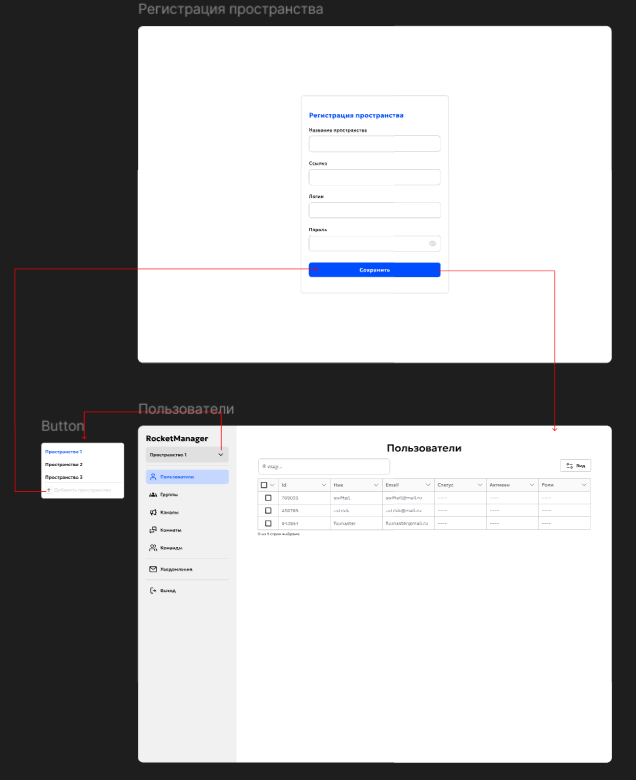
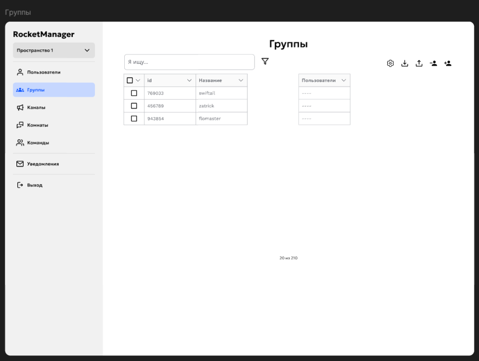
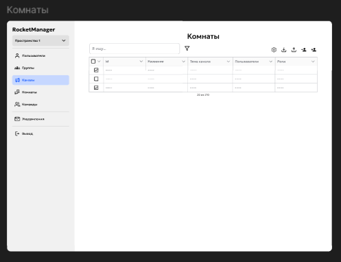

# Система управления пространствами Rocket.Chat (обёртка над API)

## Основная проблема

Проект решает задачу упрощения и автоматизации рутинных задач администрирования Rocket.Chat, таких как управление пользователями, создание комнат, сброс паролей и мониторинг активности. В текущей версии управления, когда все эти операции выполняются вручную через веб-интерфейс чата или скрипты, процесс становится неэффективным и трудозатратным, особенно при работе с большим количеством пользователей и пространств.

### Категории пользователей:

- **Администраторы Rocket.Chat**: Для администраторов критично наличие инструмента, который упрощает массовое управление пользователями, создание комнат и групп, а также управление паролями. Основной приоритет для этой категории — автоматизация и сокращение времени на выполнение рутинных операций.

В результате проекта администраторы получат эффективное веб-приложение, которое позволит автоматизировать множество рутинных задач и упростит процессы работы с пользователями и пространствами.

Собранные и проанализированные требования [Файл](https://docs.google.com/spreadsheets/d/1kFtNcfJ5LSXiRemEKN3Jp4_cDXKjKZzD_wAxjGqOEXo/edit?usp=drive_link)

## Важные ссылки по проекту {#важные-ссылки}:
- [Google диск](https://drive.google.com/drive/folders/17UqM0HQxNNSFASZToOG31zvY4lBywogW?usp=sharing)

## Созвоны
- 19.02 "Установочный созвон с заказчиком" - [Видео созвона](https://drive.google.com/file/d/1fuV6T1Pz0x65xq_crpFkzh3fJxcRnu-M/view?usp=drive_link),[Протокол созвона](https://docs.google.com/document/d/13HYdbLqcll7nwrs00wcXWWKeJ4-dftQDDA2424svJtc/edit?usp=drive_link)

## Итерации
- [Итерация 1](https://drive.google.com/drive/folders/1cgXuRVM2eAp7yFS5OYtudYH-PBtbQSNq?usp=sharing)

## Макет проекта в фигме
[Ссылка на макет](https://www.figma.com/design/1Fm0lzr0mrgXzQTRJC4MYu/RocketManager?node-id=0-1&t=BaHwGUoHsekZdO76-1)

