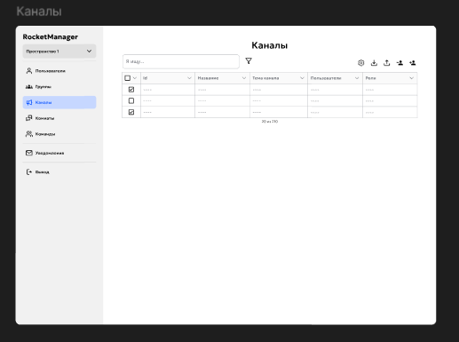
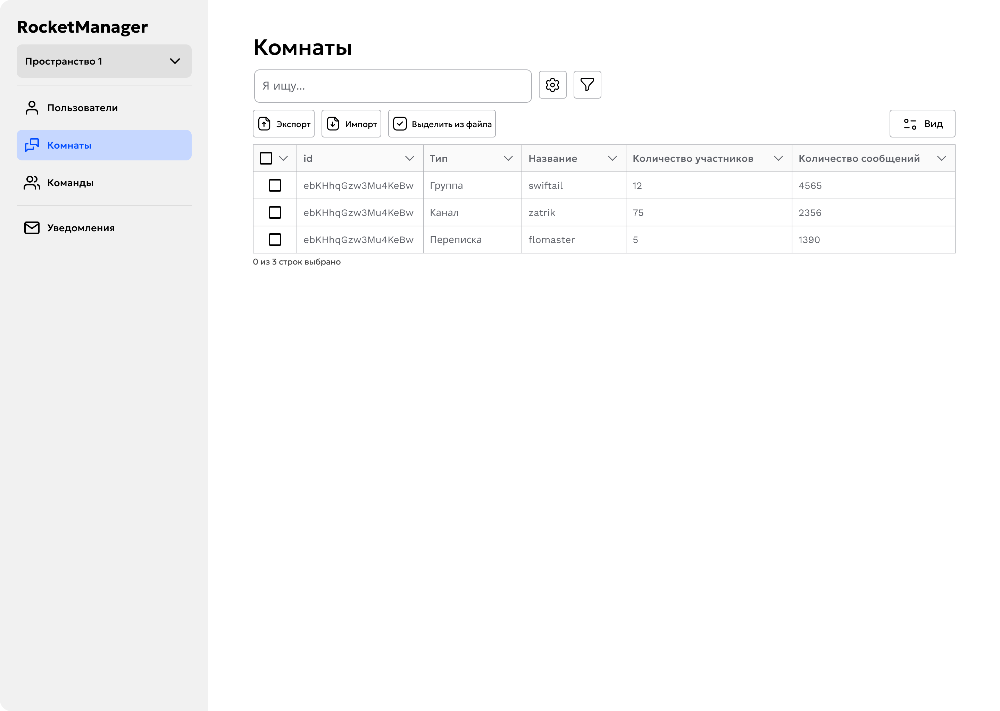
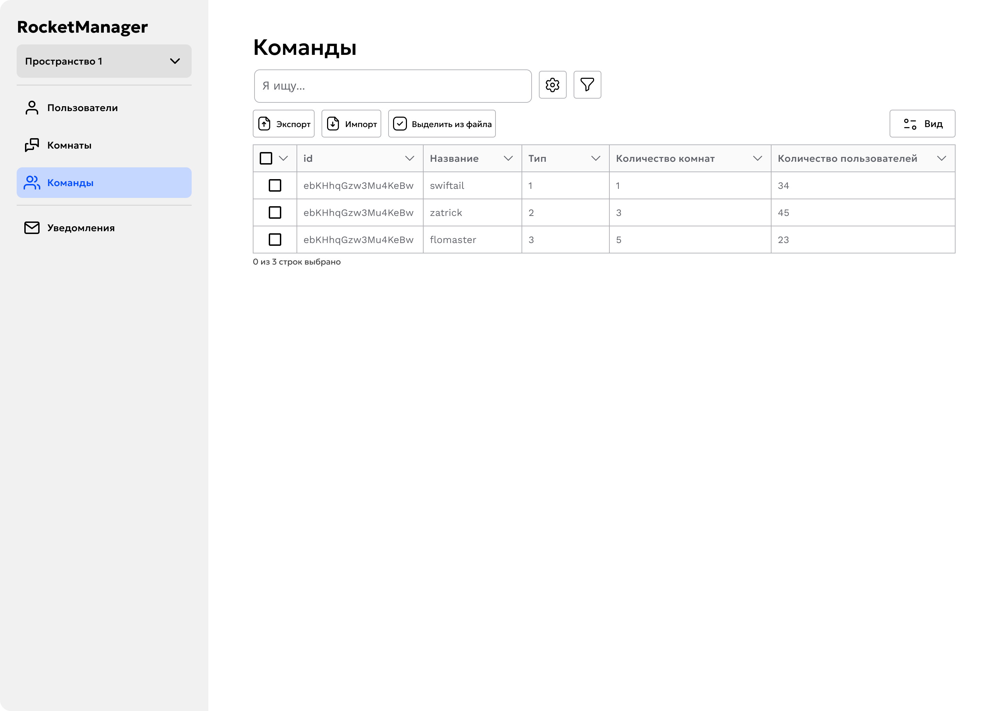
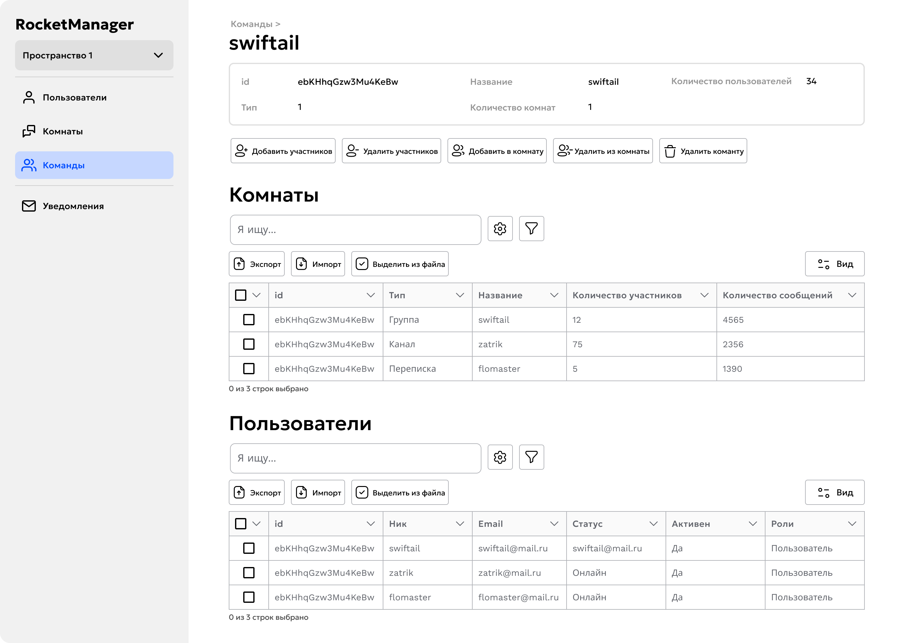
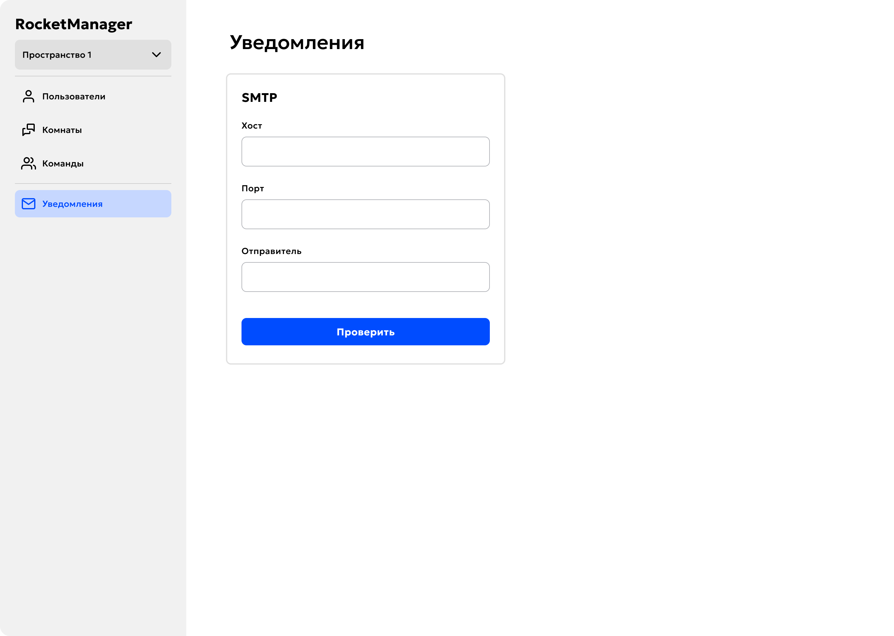
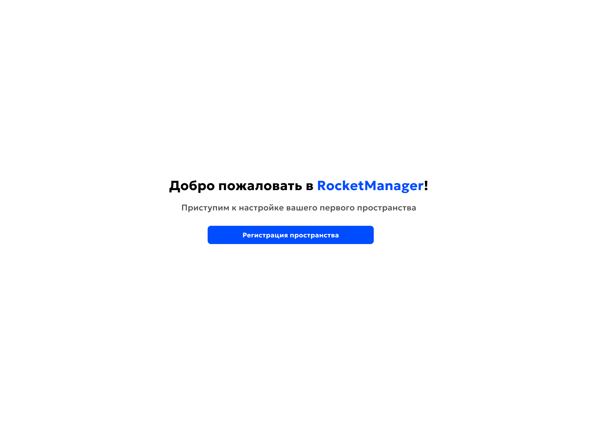
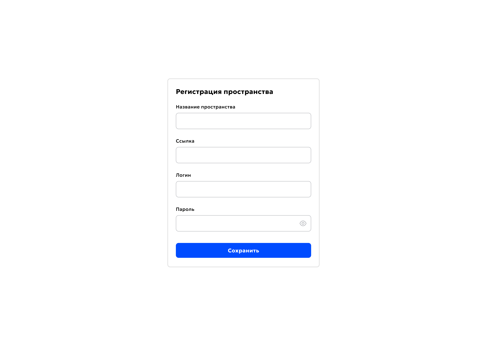

# Система управления пространствами Rocket.Chat (обёртка над API)

## Постановка задачи

Цель проекта — разработать систему управления пространствами Rocket.Chat, которая автоматизирует и упрощает рутинные задачи администрирования чатов и пользователей. В рамках этого проекта необходимо создать веб-приложение, которое будет выполнять операции, требующие значительных усилий при ручном администрировании через веб-интерфейс. Это включает управление пользователями, создание комнат, сброс паролей, а также мониторинг активности пользователей.

Проект должен быть ориентирован на администраторов, работающих с несколькими пространствами Rocket.Chat. Основные задачи включают массовое добавление пользователей, создание и управление группами и чатами, настройку и отправку приветственных сообщений, генерацию случайных паролей, а также мониторинг активности пользователей с возможностью их удаления или переноса между различными пространствами.

Для реализации этого функционала будет использоваться веб-интерфейс, поддерживающий работу с несколькими пространствами Rocket.Chat, систему управления пользователями через CSV-файлы, а также автоматическую отправку писем через SMTP. Также важно реализовать возможность мониторинга пользователей по времени их активности, а также инструмент для массового удаления и экспорта пользователей.

Технически приложение будет построено на Python с использованием MongoDB для хранения данных, Docker для контейнеризации и интеграцией с API Rocket.Chat для выполнения административных операций. Результатом будет полноценная система, которая позволит администратору эффективно управлять пространствами Rocket.Chat, экономя время и усилия при выполнении рутинных задач.

## Основная проблема

Проект решает задачу упрощения и автоматизации рутинных задач администрирования Rocket.Chat, таких как управление пользователями, создание комнат, сброс паролей и мониторинг активности. В текущей версии управления, когда все эти операции выполняются вручную через веб-интерфейс чата или скрипты, процесс становится неэффективным и трудозатратным, особенно при работе с большим количеством пользователей и пространств.

### Категории пользователей:

- **Администраторы Rocket.Chat**: Для администраторов критично наличие инструмента, который упрощает массовое управление пользователями, создание комнат и групп, а также управление паролями. Основной приоритет для этой категории — автоматизация и сокращение времени на выполнение рутинных операций.

В результате проекта администраторы получат эффективное веб-приложение, которое позволит автоматизировать множество рутинных задач и упростит процессы работы с пользователями и пространствами.

### Собранные и проанализированные требования [Ссылка на файл](https://docs.google.com/spreadsheets/d/1kFtNcfJ5LSXiRemEKN3Jp4_cDXKjKZzD_wAxjGqOEXo/edit?usp=drive_link)

### Все файлы, которые представлены внешними ссылками, продублированы тут: [Перейти в папку "files"](docs/files/)

## Важные ссылки по проекту:
- [Google диск](https://drive.google.com/drive/folders/17UqM0HQxNNSFASZToOG31zvY4lBywogW?usp=sharing)
- [Гайд для установки и запуска релизной версии](docs/files/deployment_guide.md)

## Созвоны
- 19.02 "Установочный созвон с заказчиком" - [Видео созвона](https://drive.google.com/file/d/1fuV6T1Pz0x65xq_crpFkzh3fJxcRnu-M/view?usp=drive_link),[Протокол созвона](https://docs.google.com/document/d/13HYdbLqcll7nwrs00wcXWWKeJ4-dftQDDA2424svJtc/edit?usp=drive_link)
- 28.04 "Созовон с заказчиком" - [Видео созвона](https://drive.google.com/file/d/1us8EU02PRC8MiZrD6LZcyddWHmM8m7--/view?usp=sharing),[Протокол созвона](https://docs.google.com/document/d/1QdUJP7gTy0UDSMEBgGXwyO2gufR9L35N2ET2OIKvchg/edit?usp=sharing)

## Презентационные материалы по итерациям
- [Итерация 1](https://drive.google.com/drive/folders/1cgXuRVM2eAp7yFS5OYtudYH-PBtbQSNq?usp=sharing)
- [Итерация 2](https://drive.google.com/drive/folders/1SJm08sUdA8MLXN2RVRCKJ4dqcyaZYY6z?usp=sharing)
- [Итерация 3](https://drive.google.com/drive/folders/1t6ETYGQydHmT-OFfqr1GdcGjVoDtWogv?usp=sharing)
- [Итерация 4](https://drive.google.com/drive/folders/1M1Op9lR1ru3d7IPCavYrx5TQcKNl-mYm?usp=sharing)

## Макет проекта в фигме
[Ссылка на макет](https://www.figma.com/design/1Fm0lzr0mrgXzQTRJC4MYu/RocketManager?node-id=0-1&t=BaHwGUoHsekZdO76-1)

## Сценарии использования

### Добавление пространства

#### Предусловия

- Пройдена авторизация
- Добавлено нужное пространство

#### Основной сценарий

| Шаг | Пользователь                                                                                        | Система                                                                   |
|-----|-----------------------------------------------------------------------------------------------------|---------------------------------------------------------------------------|
| 1   | Пользователь нажимает на кнопку выбора пространства                                                 | Система открывает окно выбора пространства                                |
| 2   | Пользователь нажимает на кнопку "Добавить пространство"                                             | Система открывает окно "Регистрация пространства"                         |
| 3   | Пользователь по очереди вводит значения полей "Названия пространства", "Ссылка", "Логин" и "Пароль" | Система проверяет правильность ввода                                      |
| 4   | Пользователь нажимает на кнопку "Сохранить"                                                         | Система сохраняет данные пространства и добавляет его в список для выбора |
| 5   | Возврат к шагу 1                                                                                    | -                                                                         |

#### Альтернативные сценарии

| Шаг | Пользователь                                                           | Система                                                          |
|-----|------------------------------------------------------------------------|------------------------------------------------------------------|
| 3   | Пользователь по очереди вводит данные для несуществующего пространства | Система проверяет правильность ввода                             |
| 4   | Пользователь нажимает на кнопку "Сохранить"                            | Система выводит сообщение о том, что пространства не существует  |
| 5   | Возврат к шагу 3                                                       | -                                                                |

| Шаг | Пользователь                                                                   | Система                                                         |
|-----|--------------------------------------------------------------------------------|-----------------------------------------------------------------|
| 3   | Пользователь по очереди вводит данные для уже зарегистрированного пространства | Система проверяет правильность ввода                            |
| 4   | Пользователь нажимает на кнопку "Сохранить"                                    | Система выводит сообщение о том, что пространство уже добавлено |
| 5   | Возврат к шагу 3                                                               | -                                                               |

### Экспорт участников команды

#### Предусловия

- Пройдена авторизация
- Добавлено и выбрано пространство

#### Основной сценарий

| Шаг | Пользователь                                                                                                  | Система                                                                                              |
|-----|---------------------------------------------------------------------------------------------------------------|------------------------------------------------------------------------------------------------------|
| 1   | Пользователь нажимает на кнопку "Команды"                                                                     | Система отображает окно с таблицей команд                                                            |
| 2   | Пользователь нажимает на галочку в самом левом столбце таблицы в строке с нужной командой                     | Система отображает строку, как выбранную                                                             |
| 3   | Пользователь нажимает на кнопку "Экспорт"                                                                     | Система открывает окно для выбора формата и пути экспорта                                            |
| 4   | Пользователь выбирает формат файла поля для экспорта и путь экспорта файла в появившемся окне и нажимает "ОК" | Система закрывает окно и сохраняет файл с участниками команды в выбранном формате по выбранному пути |
| 5   | Возврат к шагу 1                                                                                              | -                                                                                                    |

#### Альтернативные сценарии

| Шаг | Пользователь                                  | Система                |
|-----|-----------------------------------------------|------------------------|
| 4   | Пользователь нажимает на кнопку закрытия окна | Система закрывает окно |
| 5   | Возврат к шагу 1                              | -                      |

| Шаг | Пользователь                            | Система                                                                 |
|-----|-----------------------------------------|-------------------------------------------------------------------------|
| 2   | Пользователь нажимает на кнопку Экспорт | Система выводит уведомление о том, что для экспорт нужно выбрать группу |
| 3   | Возврат к шагу 1                        | -                                                                       |

### Импорт пользователей в пространство

#### Предусловия

- Пройдена авторизация
- Добавлено нужное пространство

#### Основной сценарий

| Шаг | Пользователь                                             | Система                                                                                                                                                                    |
|-----|----------------------------------------------------------|----------------------------------------------------------------------------------------------------------------------------------------------------------------------------|
| 1   | Пользователь выбирает нужное пространство                | -                                                                                                                                                                          |
| 2   | Пользователь нажимает на кнопку "Пользователи"           | Система отображает таблицу участников пространства                                                                                                                         |
| 3   | Пользователь нажимает на кнопку "Импорт"                 | Система открывает окно для импорта                                                                                                                                         |
| 4   | Пользователь нажимает на кнопку "Загрузить с устройства" | Система открывает окно для выбора файла                                                                                                                                    |
| 5   | Пользователь выбирает файл и нажимает "ОК"               | Система загружает файл и отображает его название в окне импорта                                                                                                            |
| 6   | Пользователь нажимает на кнопку "Импорт" в окне импорта  | Система проверяет поля в файле и импортирует пользователей в пространство. Система генерирует пароль для добавленных пользователей и отправляет логин и пароль им на почту |
| 7   | Возврат к шагу 1                                         | -                                                                                                                                                                          |

#### Альтернативные сценарии

| Шаг | Пользователь                                                       | Система                                                                                   |
|-----|--------------------------------------------------------------------|-------------------------------------------------------------------------------------------|
| 5   | Пользователь выбирает файл с некорректными данными и нажимает "ОК" | Система загружает файл и отображает его название в окне импорта                           |
| 6   | Пользователь нажимает на кнопку "Импорт" в окне импорта            | Система проверяет поля в файле и выводит сообщение, что файл содержит некорректные данные |
| 7   | Возврат к шагу 5                                                   | -                                                                                         |

### Удаление команды из комнаты

#### Предусловия

- Пройдена авторизация
- Добавлено пространство
- Добавлены пользователи
- Добавлена комната с участниками
- Добавлена команда с участниками

#### Основной сценарий

| Шаг | Пользователь                                              | Система                                               |
|-----|-----------------------------------------------------------|-------------------------------------------------------|
| 1   | Пользователь выбирает нужное пространство                 | -                                                     |
| 2   | Пользователь нажимает на кнопку "Комнаты"                 | Система отображает таблицу комнат                     |
| 3   | Пользователь нажимает на строку с нужной комнатой         | Система открывает окно для выбора действия с комнатой |
| 4   | Пользователь нажимает на кнопку "Удалить команду"         | Система открывает окно удаления команд                |
| 5   | Пользователь выбирает нужную команду                      | Система отображает выбранную команду в окне удаления  |
| 6   | Пользователь нажимает на кнопку "Удалить" в окне удаления | Система удаляет команду                               |
| 7   | Возврат к шагу 1                                          | -                                                     |

#### Альтернативные сценарии

| Шаг | Пользователь                                              | Система                                                       |
|-----|-----------------------------------------------------------|---------------------------------------------------------------|
| 5   | Пользователь нажимает на кнопку "Удалить" в окне удаления | Система отображает сообщение о том, что нужно выбрать команду |
| 6   | Возврат к шагу 5                                          | -                                                             |

### Добавление пользователей из пространства в команду

#### Предусловия

- Пройдена авторизация
- Добавлено пространство
- Добавлены пользователи
- Добавлена команда

#### Основной сценарий

| Шаг | Пользователь                                                                                | Система                                                                            |
|-----|---------------------------------------------------------------------------------------------|------------------------------------------------------------------------------------|
| 1   | Пользователь выбирает нужное пространство                                                   | -                                                                                  |
| 2   | Пользователь нажимает на кнопку "Команды"                                                   | Система отображает таблицу команд                                                  |
| 3   | Пользователь нажимает на строку с нужной командой                                           | Система открывает окно для выбора действия с командой                              |
| 4   | Пользователь нажимает на кнопку "Добавить участников"                                       | Система открывает окно добавления участников со списком пользователей пространства |
| 5   | Пользователь выбирает нужных пользователей из списка нажатием на галочку рядом с их именами | Система отображает пользователей как выбранных                                     |
| 6   | Пользователь нажимает на кнопку "Да" в окне добавления участников                           | Система добавляет выбранных участников в команду                                   |
| 7   | Возврат к шагу 1                                                                            | -                                                                                  |

#### Альтернативные сценарии

| Шаг | Пользователь                                                      | Система                                                                                          |
|-----|-------------------------------------------------------------------|--------------------------------------------------------------------------------------------------|
| 5   | Пользователь нажимает на кнопку "Да" в окне добавления участников | Система не добавляет никого в команду и отображает сообщение о том, что нужно выбрать участников |
| 6   | Возврат к шагу 5                                                  | -                                                                                                |

> Выше отображены лишь некоторые из возможных сценариев использования
